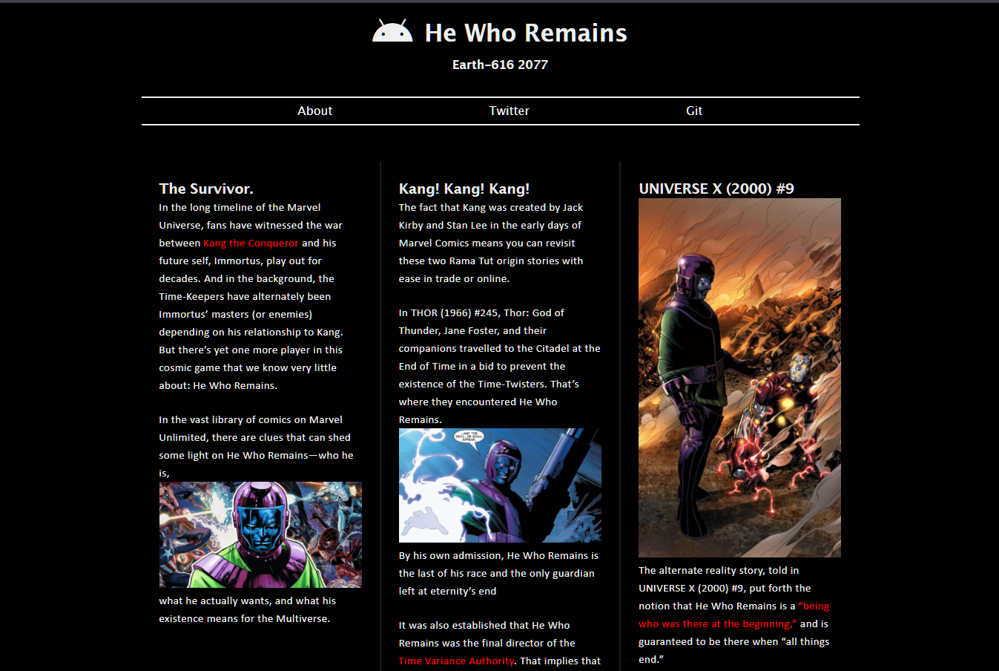
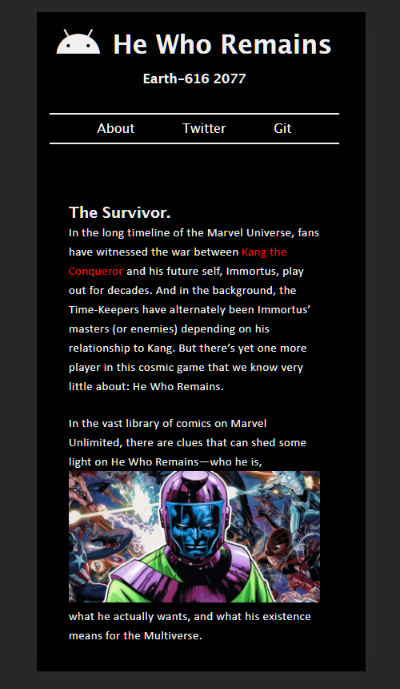

# kang-the-conqueror

CSS the flexBox

Preview Kang [flex](https://ullaskunder3.github.io/kang-the-conqueror/)

Flexbox, or the Flexible Box Layout, is a powerful CSS layout module that gives web designers and developers an efficient and simple way to lay out, align and distribute elements in a container.

Desktop view                    |  Mobile view
:------------------------------:|:-------------------------:
  |  

If you're new to responsive web design, media queries are the first, most important CSS feature to learn. Media queries allow you to style elements based on viewport width. One popular CSS strategy is to write mobile styles first and build on top of them with more complex, desktop specific styles.

Flexbox is made up of two elements: a flex container (or flex parent) and flex items (flex children). A flex container is a containing element (like a div) given the display property flex. Flex items are child elements of a flex container, which can be manipulated through various display properties.
